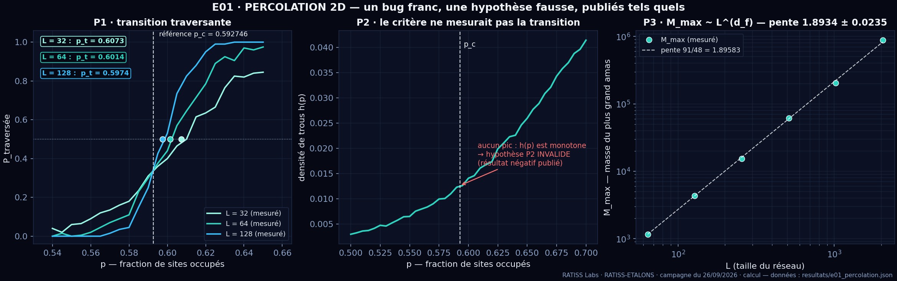
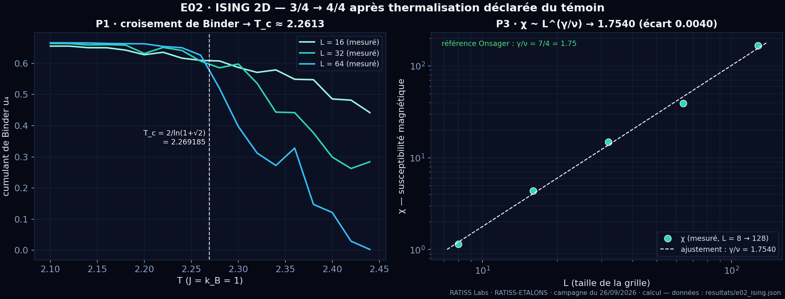
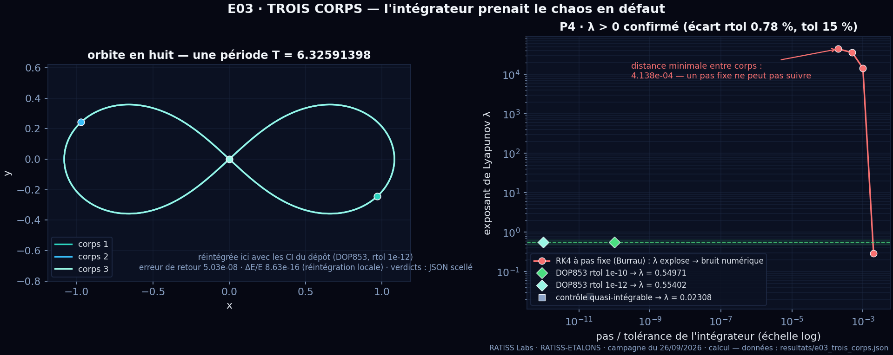
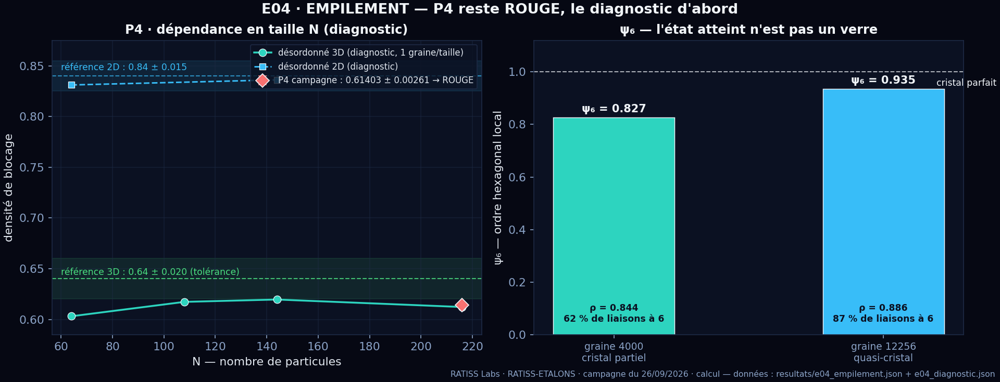

<div align="center">


# 🧮 RATISS-ETALONS

**Quatre étalons scientifiques pour vérifier nos instruments avant de leur confier un vrai sujet.**

Campagne **RATISS Labs** (Yaoundé) · étiquette de terrain **🧮 calcul** · MIT

`14/16 tests verts` · `2 échecs publiés` · `7 corrections déclarées` · `sceau SHA-256 : 17/17`

</div>

---

Un étalon, c'est un problème dont la réponse est déjà connue par la science établie. Le critère est écrit **avant** la première ligne de code — [`PROTOCOLE.md`](PROTOCOLE.md), figé le 26/09/2026 — puis on lance, et on publie **tel quel**, y compris quand ça rate. Si l'instrument retrouve les valeurs connues, il gagne le droit de servir ensuite. Sinon, ce sont les instruments qu'on répare.

**Résultat en une phrase :** les quatre valeurs de référence étaient bonnes — **trois instruments sur quatre étaient faux au premier essai**, et [le rapport](RAPPORT.md) dit précisément de quelle façon.

---

## 📌 Tu ouvres ce dépôt sans contexte ? Lis dans cet ordre

| Ordre | Fichier | Pourquoi |
|---|---|---|
| **1** | [`PROTOCOLE.md`](PROTOCOLE.md) | Les critères et tolérances, **figés avant exécution**. Zéro valeur ajustée après coup. |
| **2** | [`RAPPORT.md`](RAPPORT.md) | Le récit complet : le bug franc, le témoin non thermalisé, l'intégrateur qui ment, et les deux rouges assumés. |
| **3** | [`resultats/`](resultats/) | Les JSON bruts — `verdicts` (protocole initial) et `verdicts_v2` **cohabitent** dans le même fichier. |
| **4** | [`MANIFESTE.json`](MANIFESTE.json) | Les 17 empreintes SHA-256 qui scellent le tout. |

## 🧭 Les quatre étalons

| # | Étalon | Ce qu'il teste | Valeur de référence |
|---|---|---|---|
| **E01** | Percolation 2D 🕳️ | seuil critique, dimension fractale, topologie des trous | `p_c = 0.592746` · `d_f = 91/48` |
| **E02** | Ising 2D 🧲 | Monte-Carlo, classe d'universalité | `T_c = 2/ln(1+√2) = 2.269185` · `β/ν = 1/8` · `γ/ν = 7/4` |
| **E03** | Trois corps 🪐 | intégration numérique, chaos | orbite en huit, période `T = 6.32591398` |
| **E04** | Empilement ⚪ | géométrie exacte + compression | `π/(2√3) = 0.906900` (2D) · `π/(3√2) = 0.740480` (3D) · RCP `0.84` / `0.64` |

## 📊 Tableau de bord

| Étalon | 1er passage | après correction de bug | après corrections de méthode déclarées |
|---|---|---|---|
| **E01** percolation 🕳️ | **1/4** | **2/4** | **3/4** — *P2 reste rouge* |
| **E02** Ising 2D 🧲 | — | **3/4** | **4/4** |
| **E03** trois corps 🪐 | — | **3/4** | **4/4** |
| **E04** empilement ⚪ | — | **3/4** | **3/4** — *P4 reste rouge* |

**11/16 → 14/16.** Les deux tests qui restent rouges ne sont pas cachés : chacun a sa section dans le rapport, avec sa cause **mesurée** — pas contournée, pas de tolérance déplacée.

## 🎯 Les chiffres qui comptent

| Grandeur | Référence | Mesuré | Écart |
|---|---|---|---|
| Seuil de percolation `p_c` | 0.592746 | 0.59214 | **0.00060** (tol. 0.005) |
| Dimension fractale `d_f` (M_max) | 1.89583 | 1.8934 ± 0.0192 | 0.0024 (tol. 0.060) |
| Ising `T_c` (croisement de Binder) | 2.269185 | 2.2613 | 0.0079 (tol. 0.030) |
| Ising `γ/ν` | 1.75 | 1.7540 | 0.0040 (tol. 0.200) |
| Orbite en huit — retour à `T` | 6.32591398 | erreur de position 1.31e−05 | < 1e−3 |
| Conservation de l'énergie E03 | ΔE/E ≈ 0 | **1.21e−15** | < 1e−9 |
| Lyapunov Burrau (DOP853) | λ > 0, stable en tolérance | 0.55402 (vs 0.54971 à rtol 1e−10) | 0.78 % (tol. 15 %) |
| Hexagonal 2D | 0.906899682117109 | 0.906899682117109 | **0.00e+00** |
| FCC 3D | 0.740480489693 | 0.740480489693060 | 4.44e−16 — *epsilon machine* |

## 📈 Les figures — tracées depuis les JSON scellés

R7 appliqué au pixel : **aucune image décorative**. Chaque courbe vient d'un fichier de `resultats/` (scellés par le manifeste), et tout se régénère par une commande :

```bash
python3 outils/figures.py    # → assets/fig_*.png (numpy + scipy + matplotlib)
```

<div align="center">

**E01 — un bug franc, une hypothèse fausse, publiés tels quels**



**E02 — la classe d'universalité d'Onsager retrouvée**



**E03 — l'intégrateur prenait le chaos en défaut**



**E04 — P4 reste rouge, le diagnostic d'abord**



</div>

Précision honnête, inscrite dans le script : sur la figure E03, la **trajectoire** de l'orbite en huit est réintégrée à la volée avec les conditions initiales du dépôt (DOP853, rtol 1e-12 — erreur de retour 5.03e-08) ; les **verdicts**, eux, restent ceux du JSON scellé. C'est la seule valeur recalculée de toutes les figures.

## 🔴 Les deux tests rouges — assumés

### E01-P2 · c'est l'hypothèse qui était fausse, pas l'instrument

Le critère demandait le pic de la densité de trous à `p_c`. Mesure publiée : `h(p)` est **monotone** sur tout l'intervalle balayé — il n'y a aucun pic. Trois estimateurs de remplacement testés (pic de susceptibilité, pic de `|dP_span/dp|`), **aucun ne tient la tolérance** à `L ≤ 256`. Conséquence publiée noir sur blanc : `p_c` est localisé à 0.0006 près par **une seule** méthode ; le second estimateur indépendant reste hors de portée. *(RAPPORT §2.3)*

### E04-P4 · le diagnostic vaut mieux que le score

`0.61403 ± 0.00261` contre `0.64 ± 0.020` : hors tolérance, point. Deux hypothèses testées, pas supposées (`outils/diagnostic_e04.py`) : la taille finie (densité de blocage 0.603 → 0.620 de `N = 64` à `216`, tendance montante) et l'état atteint — **ψ₆ = 0.827 et 0.935 : nos empilements sont partiellement cristallins, pas des verres**. P2 est conforme au chiffre (0.833 contre 0.84) mais pas nécessairement à l'état *random* que décrit la littérature. La suite (plus grand `N`, compression plus lente, ψ₆ systématique) est identifiée — elle **n'est pas faite ici**, et la campagne ne prétend pas le contraire. *(RAPPORT §5.1)*

> ⚠️ Et rappel : `0.84` et `0.64` ne sont **pas** des théorèmes — ce sont des résultats numériques qui dépendent du protocole de compression.

## 🔧 Les corrections de méthode — toutes déclarées

Aucune tolérance n'a bougé. Sept changements, chacun avec sa cause mesurée :

| # | Étalon | Avant | Après | Pourquoi |
|---|---|---|---|---|
| 1 | E01 | même grille réutilisée aux 200 tirages | tirage indépendant | **bug franc** : `P_span` valait 0 ou 1 |
| 2 | E01 | densité de trous | abandonnée | mesure monotone : hypothèse invalide |
| 3 | E01 | box-counting à échelle fixe | `M_max(L) ~ L^{d_f}` | dérive 1.77 → 1.86 selon les échelles |
| 4 | E02 | témoin, 1 500 balayages | départ ordonné | moussage de domaines documenté : 0.18791 → 0.99928 |
| 5 | E03 | RK4 à pas fixe | DOP853 + contrôle de tolérance | rencontre serrée à 4.138e−04 : λ = +44124, du bruit, pas du chaos |
| 6 | E03 | témoin d'éjection à t=40 | t=40 **et** t=60 | l'éjection se produit entre les deux |
| 7 | E04 | — | *diagnostic, pas correction* | P4 reste rouge, tolérance intacte |

L'ancienne valeur et la nouvelle cohabitent dans le même JSON. Un intégrateur adaptatif RK4 a même été écrit puis **rejeté** pour E03 — la fonction reste dans le script, marquée `REJETE` : un échec documenté vaut mieux qu'un échec oublié. *(Loi n°2 du labo : les bugs se documentent.)*

## ⚖️ Ce que la campagne établit — et ce qu'elle n'établit pas

**Elle établit :**
- quatre instruments numériques rejouables qui retrouvent des valeurs publiques connues, dont deux à l'epsilon machine ;
- que trois d'entre eux étaient faux au premier essai, **et de quelle façon** ;
- deux résultats négatifs nets : le critère P2 de E01 repose sur une hypothèse fausse, et le compresseur 3D sous-estime le désordre de 0.026 à `N = 216` ;
- que nos empilements 2D ne sont **pas** des verres (ψ₆ = 0.827 et 0.935) ;
- que `p_c` est localisé à 0.0006 près par une méthode — un second estimateur indépendant manque encore.

**Elle n'établit pas :**
- que ces instruments mesureront correctement un sujet **inconnu** — c'est précisément ce qu'un étalon ne peut pas garantir ;
- aucune barre d'erreur statistique complète : tailles finies et bruit Monte-Carlo sont visibles dans les écarts, pas quantifiés ;
- aucune physique nouvelle : toutes les valeurs de référence sont publiques et connues d'avance ;
- **rien sur les QPU** : ce rapport est 🧮 **calcul**, aucune mesure sur machine IBM. On ne mélange jamais les deux.

## ▶️ Rejouer

```bash
git clone https://github.com/jonathansearch/RATISS-ETALONS.git
cd RATISS-ETALONS

python3 etalons/e01_percolation.py     # ~30 s
python3 etalons/e02_ising.py           # ~10 min
python3 etalons/e03_trois_corps.py     # ~3 min
python3 etalons/e04_empilement.py      # ~40 min

python3 outils/diagnostic_e04.py       # diagnostic déclaré de l'écart P4 (~15 min)
python3 outils/manifeste.py --verifier # vérification du sceau SHA-256
```

Dépendances : `numpy` + `scipy`, rien d'autre *(campagne exécutée avec numpy 2.3.5 + scipy 1.17.1)*. Chaque script écrit son JSON dans `resultats/`.

> **R7** : chaque affirmation de ce README est rejouable par une commande ci-dessus. Un étranger doit pouvoir vérifier sans demander la permission.

## 🔒 Vérifier l'intégrité

```bash
python3 outils/manifeste.py --verifier   # 17/17 empreintes SHA-256 conformes
```

Toute modification d'un fichier du dépôt casse le sceau — c'est fait exprès. Après toute édition légitime : `python3 outils/manifeste.py` pour resceller, et la modification va au journal.

## 📜 Les règles appliquées ici

1. **Aucune valeur ajustée après coup.** Les tolérances sont figées avant exécution (`PROTOCOLE.md`, 26/09/2026).
2. **Témoins obligatoires.** Chaque étalon contient au moins un cas limite connu.
3. **Ce qui échoue est publié.** Un test rouge reste dans le rapport, avec son écart.
4. **Corrections déclarées, jamais silencieuses.** Ancienne et nouvelle valeur dans le même JSON.
5. **🧮 calcul, jamais 🛰️ QPU.** Campagne purement numérique.
6. **Un échec expliqué vaut mieux qu'un succès tu.** Les deux rouges sont diagnostiqués, pas contournés.

## 🧬 Écosystème RATISS Labs

| Dépôt / lien | Rôle |
|---|---|
| [`RATISS-ARCHIVES`](https://github.com/jonathansearch/RATISS-ARCHIVES) | La mémoire du labo : preuves, registre des 86 tâches IBM Quantum, identité |
| [`DISCORD-RATISS`](https://github.com/jonathansearch/DISCORD-RATISS) | L'agent qui poste les preuves dans le serveur du labo |
| [`RATISS-QVM`](https://github.com/jonathansearch/RATISS-QVM) · [`RATISS-NAVIER`](https://github.com/jonathansearch/RATISS-NAVIER) · [`RATISS-FUSION`](https://github.com/jonathansearch/RATISS-FUSION) | Les moteurs du labo — autorisés à servir après passage à l'étalon |
| [Site officiel](https://jonathansearch.github.io/ratiss-labs-site/) · [ORCID](https://orcid.org/0009-0000-4092-5313) | L'audit scientifique exécutable, hors GitHub |

---

*RATISS Labs · Yaoundé · campagne du 26/09/2026 · MIT*
*Les valeurs de référence de cette campagne sont publiques et vérifiables hors du labo : `p_c = 0.592746`, `T_c = 2/ln(1+√2)`, `91/48`, `π/(2√3)`, `π/(3√2)`, `T = 6.32591398`.* 🔒
